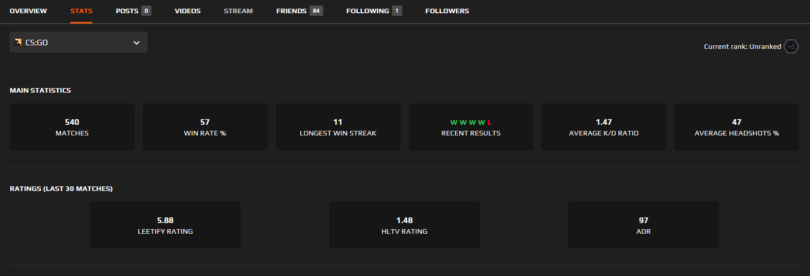
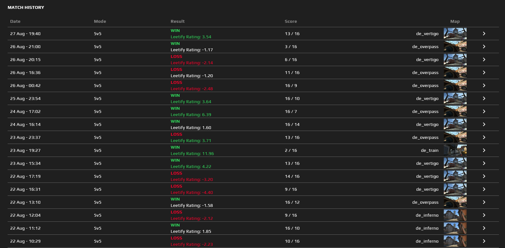
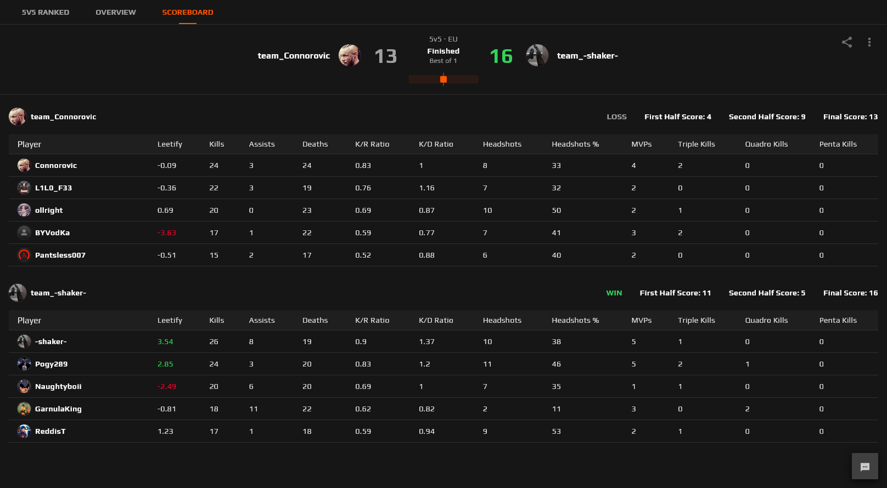

# FACEIT leetify rating

A small script that displays Leetify ratings on FACEIT

### Features
- Displays Leetify, HLTV ratings and ADR on player profiles
  - This only works for players that have a Leetify account
  - Players who don't have a Leetify account, but who have played in matches that have been analyzed by Leetify, may have a Leetify rating displayed on their profile but no HLTV rating or ADR
  
- Displays the player's Leetify rating for a match in the match history
  - This only works for players that have a Leetify account and 30 matches analyzed
  
- Displays each players' Leetify rating on the match scoreboard
  - This only works if at least one player in the match has a Leetify account and the match has been analyzed by Leetify
  

### How to install
#### __Install the [Firefox Extension](https://addons.mozilla.org/en-US/firefox/addon/faceit-leetify-rating/)__
#### Or install the userscript by following the steps below
1. Install __[Tampermonkey](https://www.tampermonkey.net/)__, [Violentmonkey](https://violentmonkey.github.io/get-it/) or any other userscript-manager of your choosing
2. Click the install link below
3. Click "Install" or "Confirm installation" or "OK"
4. You're done!  

[Install script](https://github.com/shakerrrr/faceit-leetify-rating/raw/master/faceit-leetify-rating.user.js)